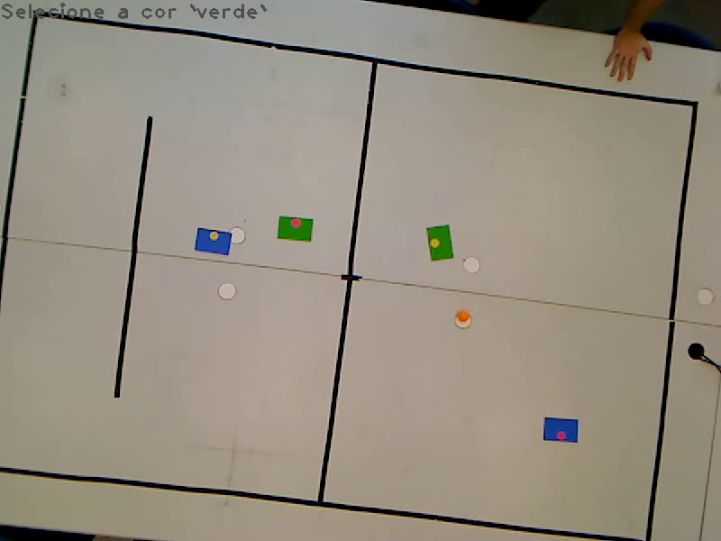
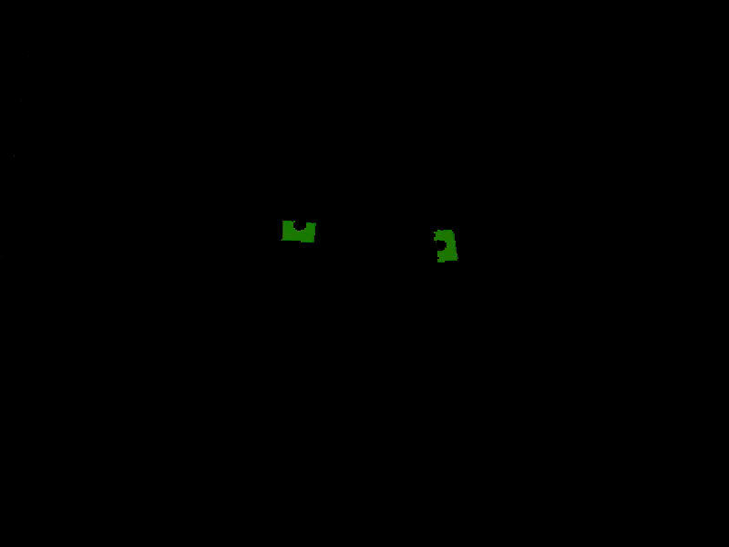
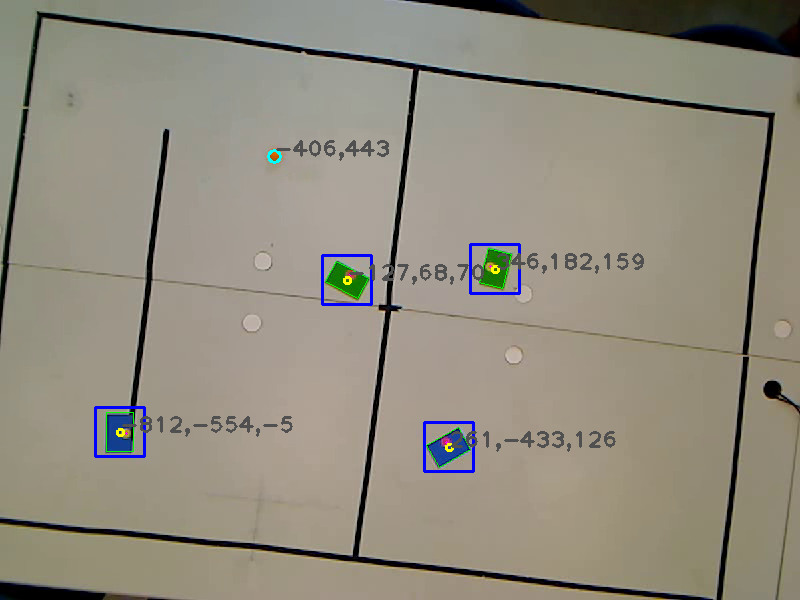

# COMPETIÇÃO INTERNA DE ROBÓTICA (CIR)

Este repositório contém o código fonte de todo o sistema utilizado para realizar a competição interna de robótica. A parte de visão computacional com OpenCV e comunicação via MQTT estão na pasta `vision`, ao passo que o código do ESP32 está na pasta `hardware`.

O ESP32 foi programado utilizando o *framework* ESP-IDF e, portanto, é necessário instalá-lo utilizando ou a vesão cli ou a vesão vscode. Clique [aqui](https://docs.espressif.com/projects/esp-idf/en/stable/esp32/get-started/index.html) para ser redirecionado à pagina referente à instalação do ESP-IDF para Windows, Linux ou MacOS.

## Visão Computacional

A pasta `vision` engloba tanto a parte de visão computacional quanto a de comunicação. Dentro desta pasta, os arquivos estão organizados da seguinte forma:

```
.
├── CMakeLists.txt
├── config.yaml
├── data
│   ├── amarelo.yaml
│   ├── azul.yaml
│   ├── calib.yaml
│   ├── laranja.yaml
│   ├── rosa.yaml
│   └── verde.yaml
├── flake.lock
├── flake.nix
├── include
│   └── futbot
│       ├── Ball.hpp
│       ├── Calibration.hpp
│       ├── Color.hpp
│       ├── Publisher.hpp
│       ├── Roi.hpp
│       ├── Team.hpp
│       └── Video.hpp
├── src
│   ├── Ball.cpp
│   ├── Calibration.cpp
│   ├── Color.cpp
│   ├── main.cpp
│   ├── Publisher.cpp
│   ├── Roi.cpp
│   ├── Team.cpp
│   └── Video.cpp
└── test
    ├── output.avi
    ├── save-pic.py
    └── save-video.py
```

### Dependências

Se estiver utilizando uma distribuição Linux baseada em Debian, como o Ubuntu, pode-se instalar os pacotes necessários com o seguinte comando:

```
sudo apt install build-essential cmake libopencv-dev libpaho-mqtt-dev libpaho-mqttpp-dev mosquitto
```

Após a instalação, é necessário iniciar o *service* mosquitto, utilizando:

```
sudo systemctl start mosquitto
```

### Código

O código foi escrito separando as funcionalidades do programa em classes. A classe `Video` é utilizada para abrir a câmera, atualizar e buscar seus frames para processamento, além de mostrar a captura da câmera em uma janela. Quando se atualiza frame, também é gerada uma cópia deste no *colorspace* HSV, para facilitar a segmentação de cores.

A classe `Calibration` utiliza a matriz de homografia para fazer a transformação de pontos nas coordenadas da imagem para as coordenadas reais. Para tanto, é necessário escolher os pontos pré-determinados no campo, que serão utilizados para estimar a pose dos objetos a partir de sua posição na imagem.

A classe `Color` guarda informações sobre as cores, como os limites inferiores e superiores das cores no *colorspace* HSV. A partir destas informações, é possível realizar segmentação das cores, para então obter os contornos das cores.

A classe `Team` armazena as cores do time e dos dois jogadores (robôs). Nela, é realizado processamento de imagens para extrair as poses e orientações dos robôs, para então serem publicadas pelo protoloco MQTT. A classe `Ball` tem objetivo semelhante, determinado a pose da bola dentro do campo.

Por fim, a classe `Publisher` é utilizada para publicar os dados para os ESP32. Conecta-se no broker local Mosquitto que estará sendo executado na própria máquina, com *socket address* `tcp://localhost:1883`.

[!CAUTION]

A fim de melhorar a legibilidade e desempenho da parte de visão computacional, foi feita uma reconstrução do código fonte. Com isso, ainda não foi possível testar as funcionalidades da comunicação via MQTT, pois eu estava de férias e não tinha acesso ao laboratório de robótica.

### Uso

É importante destacar que os arquivos da pasta `data` possuem os dados sobre a calibração da visão e os limites inferiores e superiores das cores no *colorspace* HSV.

A calibração é realizada escolhendo-se sete pontos no campo, iniciando-se pelo centro do campo, seguindo pelo canto superior esquerdo, o meio do canto superior, e assim por diante, seguindo o sentido horário.

Já para escolher as cores, é necessário apenas clicar em um ponto que possua a cor informada pelo programa. Assim, serão gerados os arquivls de extensão `yaml` na pasta `data`. A imagem abaixo mostra a seleção da cor verde e sua máscara aplicada ao frame.

 

Os dados de calibração e das cores serão recarregados quando o programa for executado novamente. Para redefinir estes dados, é necessário apenas apagar os arquivos `yaml` na pasta `data`. Fazendo isso, da próxima vez que o programa for executado, o usuário será requisitado refazer a calibração e a seleção de cores.

Para compilar o projeto, é necessário acessar a pasta `vision` e executar os seguintes comandos:

```
cmake -Bbuild -DCMAKE_BUILD_TYPE=Debug
cmake --build build
```

Após compilar, o programa pode ser executado utilizando:

```
./build/vis_comp
```

Executando o programa, serão mostradas as poses dos objetos no campo.


